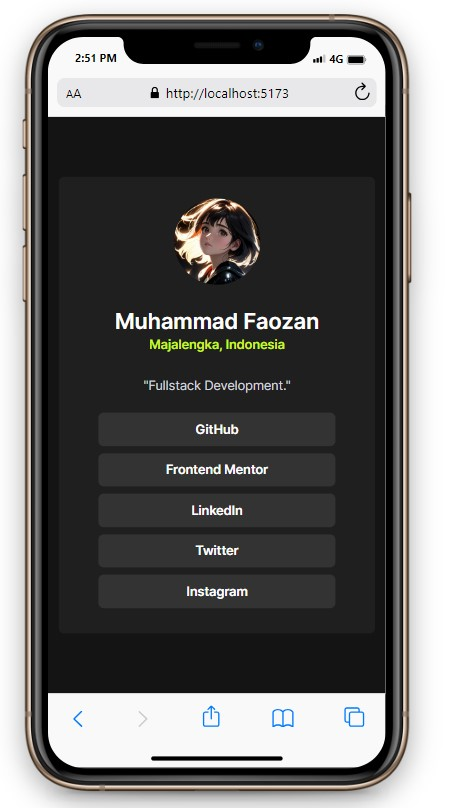
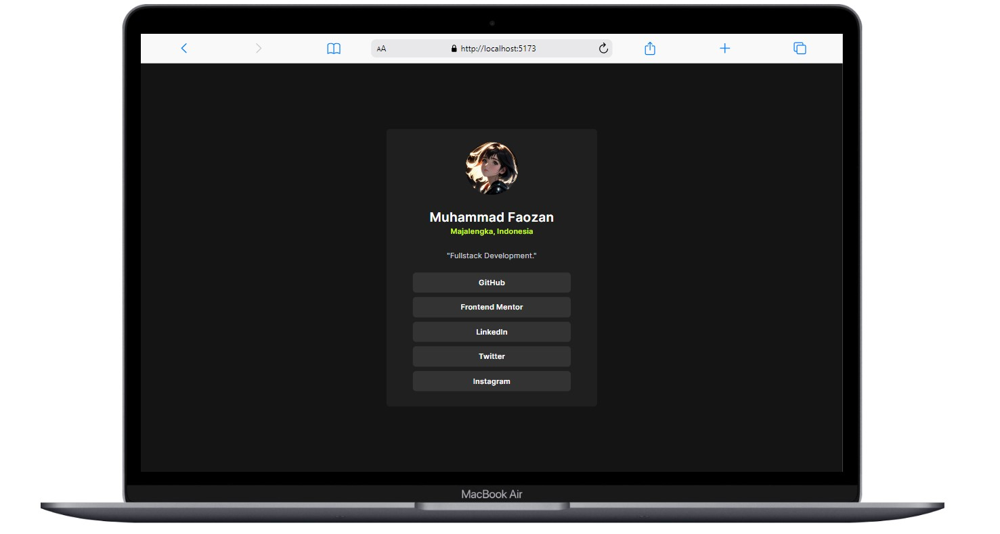

# Frontend Mentor - Social links profile solution

In this small project, you'll build out your social link-sharing profile. Created with React Js, Express Js, NodeJs, MongoDB and Tailwind CSS

## Table of contents

- [Overview](#overview)
  - [The challenge](#the-challenge)
  - [Screenshot](#screenshot)
  - [Links](#links)
- [My process](#my-process)
  - [Built with](#built-with)
- [Author](#author)

## Overview

### The challenge

Users should be able to:

- See hover and focus states for all interactive elements on the page

### Screenshot

### Links
- Live Site URL: [Add live site URL here](https://your-live-site-url.com)

## My process

### Built with

- React js
- Tailwind CSS
- Node js
- Express js
- Cloudinary

## Author

- LinkedIn - [Muhammad Faozan](https://www.linkedin.com/in/mfaozan)